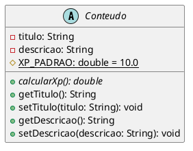
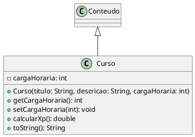
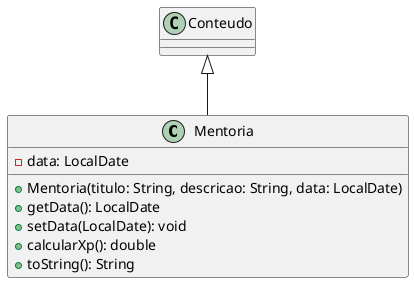
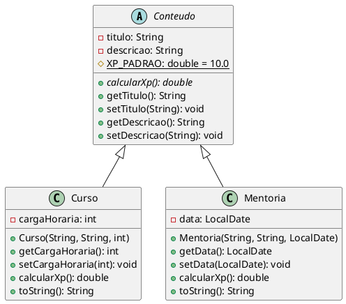

# desafioPooJava

desafio do [dio.me](https://web.dio.me/project/abstraindo-um-bootcamp-usando-orientacao-objetos-em-java/learning/8afcd659-978c-477c-93db-846b83c2927e?back=/track/formacao-java-developer) para por em prática princípios e paradigmas de orientação a objeto usando a linguagem de programação java.

# Abstração

A habilidade de abstrair consiste em criar uma arquitetura de software que aproveite o que é necessário para resolver um problema, sem considerar informações que são irelevantes para o caso.

## Exemplo

Quando um sistema de uma livraria vai ser projetado, e precisa guardar informações sobre os autores dos livros, existem informações que são importantes a respeito de que fez as obras (Nome, data de nascimento, data de falecimento, quantas obras escreveu, quais obras escreveu). Não faria sentido guardar informações que não são relevantes, como a cor do olho, tamanho do bigode e etc.

# Encapsulamento

A possíbilidade guardar informações dentro de um escopo específico, como por exemplo, os atributos e métodos de um objeto, aonde apenas dentro do escopo da própria classe é possível manipular tais informações.

## Exemplo

Uma classe que representa pessoas, contem os atributos Nome, Idade e CPF, São informações importantes e relevantes, e não podem ser modificadas por acidente. É por isso que é importante criar métodos de GET e SET, para que seja feita a operação de modificação e obtenção dos dados de forma responsável e segura

# Herança

Um conceito muito característico do POO é o fato de que você poder ter uma classe mãe (ou super classe) e classe filha (sub classe). Aonde tudo que tem na classe mãe, a classe filha tem e tem acesso, entretanto nem tudo que está na classe filha está na classe mãe. É muito útil para não repetir códigos, o que permite uma arquitetura mais limpa e facilita muito na hora de fazer atualizações e manutenções no software. Além de permitir que possa organizar as classes com base em suas funções e em seus papeis dentro da lógica do négocio proposto pelo sistema.

## Exemplo

Uma classe mãe conteúdo:

Essa classe não vai gerar instancias no sistema, serve apenas de apoio para que possamos criar a classe Mentoria e Curso

Curso:

Mentoria:

Sendo assim, fica algo como:

# Polimorfismo

O polimorfismo é o princípio que permite que **um mesmo método se comporte de maneira diferente** em classes distintas. Ele complementa a herança, permitindo que objetos de classes diferentes sejam tratados de forma uniforme quando compartilham uma superclasse comum.

## Exemplo

Imagine um sistema de e-commerce com diferentes formas de pagamento. Todas seguem o mesmo contrato básico ("pagar"), mas cada uma processa o pagamento de forma diferente.

Isso significa que cada classe vai consumir esse método de uma maneira diferente, porém usando a mesma assinatura.
